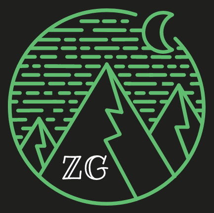

```{r setup, include=FALSE}
knitr::opts_chunk$set( message = F, warning = F, out.width = "100%",echo = FALSE)

zg_colors <- c("#222831","#393e46","#d65A31","#EEEEEE","#FFCF99","#FFCF99")

corp_colors <- c("#88BdBc","#254e58","#112d32","#4f4a41","#6E6658")

clean_mod <- c("#17252A","#2B7A78","#3AAFa9","#DEF2f1","#FEFFFF")

nature <- c("#687864","#31708E","#5085A5","#8FC1E3","#F7F9FB")

peaceful_mod <- c("#844D36","#474853","#86B3D1","#AAA0A0","#8E8268")

corp_serious <- c("#265077","#022140","#494B68","#1E4258","#2D5F5D")
library(shiny)
library(tidyverse)


```


<style>
.main {
position : relative;
}


.mb-wrap {
margin : 20px auto;
padding : 20px;
position : relative;
text-align: center;
width: 75%;

}

@media only screen and (max-width: 600px) {
.mb-wrap {
margin : 5px auto;
padding : 5px;
position : relative;
text-align: center;
width: 100%;

}


}

.mb-wrap p {
margin : 0;
padding : 0;
}

.mb-wrap blockquote {
margin : 0;
padding : 0;
position : relative;
}

.mb-wrap cite {
font-style : normal;
}


blockquote {
    border-left: none;
}


.mb-style-2 blockquote p {
color : #Ba996E;
display : inline;
font-family : Baskerville, Georgia, serif,Sans-Serif;
font-style : italic;
font-size : 1.5em;
line-height : 2em;
}

.mb-attribution {
text-align : center;
}

.mb-author {
color : #Ba996E;
font-size : 2em;
font-weight : bold;
padding-top : 10px;
text-shadow : 0 1px 1px rgba(255, 255, 255, 0.1);
text-transform : lowercase;
}

.btn{
  border: 0px solid transparent;
}


.btn.active.focus, .btn.active:focus, .btn.focus, .btn:active.focus, .btn:active:focus, .btn:focus {
    outline: thin dotted;
    outline: 0px auto -webkit-focus-ring-color;
    outline-offset: -3px;
}


cite a {
color : #Ba996E;
font-style : italic;
}

cite a:hover {
color : #Ba996E;
}


.bouncy{
animation:bouncy 5s infinite linear;
animation-delay: 3s;
position:relative;
}

@keyframes bouncy {
0%{top:0em}
40%{top:0em}
43%{top:-0.9em}
46%{top:0em}
48%{top:-0.4em}
50%{top:0em}
100%{top:0em;}
}


.zoom {
  transition: transform .2s; /* Animation */
}

.zoom:hover {
  transform: scale(1.3); /* (150% zoom - Note: if the zoom is too large, it will go outside of the viewport) */
}


</style>


<br>

<br>

<br>

<div class="row" style="display:flex;align-items:center;">

<div class="col-md-6" align="center" style="width:100%;">
<a href="https://www.zacgarland.com/">

</a>
</div>

<div class="col-md-6" style="width:100%;">

```{r}
actionButton("go","new quote",style="display:block;margin:auto;",icon = icon("quote-right"))

```


</div>

</div>
  
  
  
```{r}

react_vals <- reactiveValues(
  
  quote = read_csv('dat/biz_quotes.csv') %>% sample_n(1) 

  
)


observeEvent(input$go,{
           react_vals$quote <- read_csv('dat/biz_quotes.csv') %>% sample_n(1)
      })


br()
br()

renderUI({


df <- react_vals$quote  
col_new <- sample(c("#771155", "#AA4488", "#CC99BB", "#114477", "#4477AA", "#77AADD", "#117777", "#44AAAA", "#77CCCC", "#117744", "#44AA77", "#88CCAA", "#777711", "#AAAA44", "#DDDD77", "#774411", "#AA7744", "#DDAA77", "#771122", "#AA4455", "#DD7788"),1)    

HTML(paste0(
'
<div class="row">
<div class="mb-wrap mb-style-2">
<blockquote>
<p style="color:',"#fff",'">',df$text,'
</p>
</blockquote>
</div>
<div class="mb-attribution">
<p class="mb-author" style="color:',col_new,'">',df$author,'</p>
</div>
</div>'))

})


```
